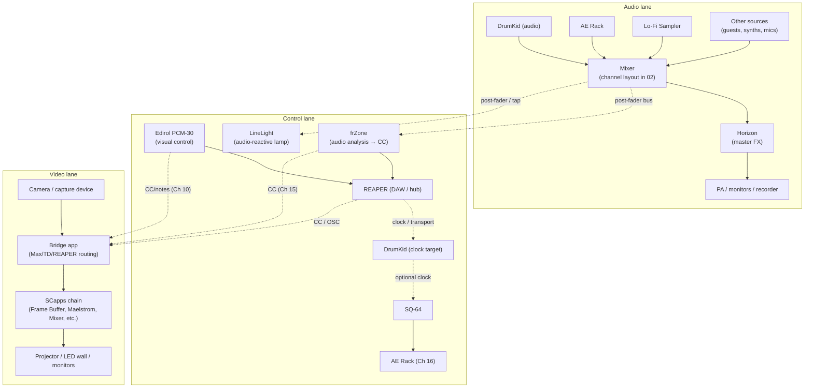

# 01 – System overview

This document is the **big-picture map** of the live rig.

It doesn’t care about exact CC numbers or knob labels yet. It cares about:

- which devices belong to which *lane*,
- how audio, control, and video cross paths,
- and where the Signal Culture modular apps (“SCapps”) sit in the ecosystem.

Think of this as the **topographic map** for everything else in this repo.

---

## Three lanes

The rig is easiest to reason about if you imagine **three vertical lanes**:

1. **Audio lane** – sound sources, mixer, FX, PA, recording.
2. **Control lane** – clock, MIDI, CCs, analysis.
3. **Video lane** – cameras/capture, SCapps, projectors/screens.

Each lane can change over time, but the *relationships* should remain stable.

---

## High-level system diagram

- **Audio lane**: devices make noise → mixer → Horizon → PA.  
- **Control lane**: REAPER runs transport/clock, Edirol and frZone write control.  
- **Video lane**: Bridge + SCapps translate those controls into moving images.

This is the shape that the rest of the repo’s files zoom into.

---

## Audio lane

The audio lane carries what the audience actually hears.

**Core pieces:**

- DrumKid (audio out)
- AE Rack (synth voices)
- Lo-Fi Sampler
- Guest sources (pedals, small synths, mics)
- Mixer (input channels, groups, buses)
- Horizon (on the master bus)
- PA / monitors / recording interface

**Responsibilities:**

- Provide a **clear main mix** that passes through Horizon before the PA.
- Provide a **post-fader bus** to feed frZone and LineLight.
- Keep enough headroom for Horizon and any other “last in chain” processing.

The details of which source hits which channel, and how the FX sends are set, live in:

- `02_audio-mixer-fx.md`

When the audio lane changes (new device, new channel plan), that file should move first; this overview should only change if the overall shape changes.

---

## Control lane

The control lane is where **time, structure, and modulation** live.

At the moment:

- **REAPER** is the *hub*:
  - Sends MIDI clock + Start/Stop to DrumKid.
  - Hosts routing for MIDI and, if needed, some bridge functions.
- **DrumKid** is the **clock target** and rhythmic heart.  
  It can pass clock on to other devices.
- **SQ-64** sequences **AE Rack** on Channel 16.
- **Edirol PCM-30** is the **visual hands**:
  - Lives on the **video-control channel** (Ch 10 by default).
  - Faders/knobs/buttons send macro-level CC / notes.
- **frZone** listens to a post-fader audio bus:
  - Emits CCs on the **analysis channel** (Ch 15).
- **LineLight** responds directly to the audio bus:
  - No MIDI, but it acts as an **on-stage indicator** of mix activity.
- **SCapps** see none of this directly; they only see what the bridge forwards.

### MIDI channel roles (control lane summary)

- **Realtime (no channel)**: REAPER → DrumKid → (others).  
- **Ch 10**: Edirol → Bridge → SCapps (visual macros).  
- **Ch 15**: frZone → Bridge → SCapps (analysis CCs).  
- **Ch 16**: SQ-64 → AE Rack (voices).

More detail on who sends what and how REAPER is configured lives in:

- `03_midi-clock-video.md`

---

## Video lane

The video lane is where all of this ends up as image.

**Key pieces:**

- A **camera** or other capture source (or pre-rendered visuals).
- A **bridge** layer:
  - Max, TouchDesigner, or REAPER routing + MIDI/OSC logic.
  - Responsible for:
    - Listening to Ch 10 (Edirol) and Ch 15 (frZone).
    - Mapping those CCs/notes to SCapps parameters and presets.
- A **SCapps chain**:
  - Frame Buffer
  - Maelstrom
  - SC Video Mixer
  - ReTrace
  - VMass
  - Interstream
- One or more **screens**:
  - Projector
  - LED bars / monitors
  - Whatever the venue has.

> In this rig, SCapps are **video endpoints**.  
> They do not manage clock, MIDI routing, or scene logic.  
> They just receive video + control and respond.

The details of which SCapps you’re using, and how they’re chained for a given set, are in:

- `04_scapps-overview.md`
- `05_scapps-rigs.md`

---

## How the lanes interact

At a glance:

- **Audio → Control → Video**
  - Audio lane goes into frZone.
  - frZone turns band energy into CC on Ch 15.
  - Bridge converts those CCs into modulation for SCapps.

- **Hands → Control → Video**
  - Edirol faders/knobs/buttons go out on Ch 10.
  - REAPER / bridge pick up those messages.
  - Bridge maps them to SCapps parameters and scene changes.

- **Clock → Everything**
  - REAPER’s transport drives DrumKid.
  - DrumKid’s patterns and fills shape the audio lane.
  - That audio drives frZone and LineLight.
  - frZone’s CCs bias the visuals.
  - Edirol rides on top to make deliberate, human-scale decisions.

If any of those cross-lane relationships change, this is the document to update.

---

## Minimal rig variants

### Audio-only minimal rig

- DrumKid → Mixer → Horizon → PA  
- Optional AE voice or Lo-Fi Sampler.

Control lane shrinks to:

- REAPER → DrumKid (clock only).

Video lane is absent.  
Docs still live here, but you only care about `02_audio-mixer-fx.md`.

### Audio + single-screen visual rig

- Audio lane as above.
- Control lane:
  - REAPER → DrumKid.
  - Edirol on Ch 10.
  - frZone on Ch 15 (if possible).
- Video lane:
  - Camera / capture → single SCapp (e.g. Frame Buffer or Maelstrom) → projector.

This is the smallest rig where the **channel grammar** and the **SCapps endpoint model** still apply.

You can sketch specific minimal layouts in per-show docs (e.g. `07_show-…`), but this section is the conceptual anchor.

---

## What changes between shows (and what shouldn’t)

**Things that can change per show:**

- Which devices are actually on the table.
- Which SCapps are in the chain.
- Which Edirol faders/knobs/buttons are mapped to which parameters.
- Which REAPER project you’re opening.

These belong in:

- `07_show-…`
- `08_midi-mapping-…`
- `05_scapps-rigs.md`

**Things that should almost never change:**

- The **three-lane structure**.
- The idea that **SCapps are endpoints**, not the hub.
- The MIDI channel roles:
  - Ch 10 as the video-control bus (Edirol).
  - Ch 15 as the analysis lane (frZone).
  - Ch 16 as AE rack voices.
  - Channel 9 mentally reserved for Horizon’s future MIDI.

If you change these, update this file first, then ripple those changes out to the rest of the repo.

---

## Pointers into the rest of the repo

- For **specific mixer channels and FX**: see `02_audio-mixer-fx.md`.  
- For **clock and MIDI routing details**: see `03_midi-clock-video.md`.  
- For **SCapps details and chains**: see `04_scapps-overview.md` and `05_scapps-rigs.md`.  
- For **frZone/LineLight specifics**: see `06_frzone-linelight.md`.  
- For **show-specific setups**: see `07_show-…` and `08_midi-mapping-…`.  
- For **EP-specific rig snapshots**: see `ep-i-hope-the-sky-will-still-take-us/`.

This file should stay short, tall, and legible. When the rig evolves, start here, then let the details catch up.
