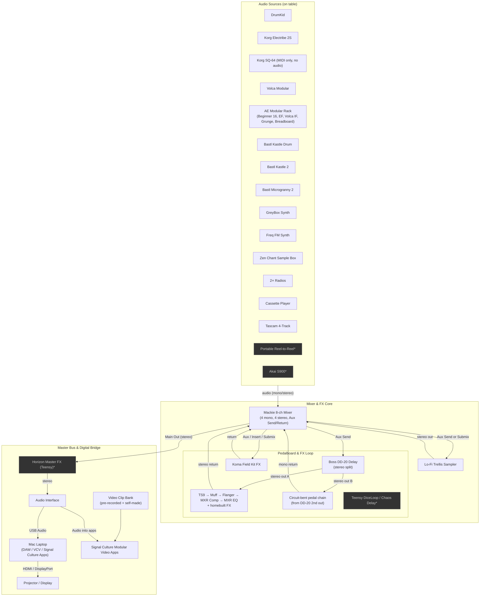

# 01 – Top-Level System Overview

## Notes

- [ ] Add specific connector types (TRS, TS, RCA, etc.) to each edge label.
- [ ] Follow mixer tape marks for live input sorts.
- [ ] Mark any gear that stays home for a minimal rig with a *+*.
- [ ] Horizon always comes *after* the final mix before the interface.
