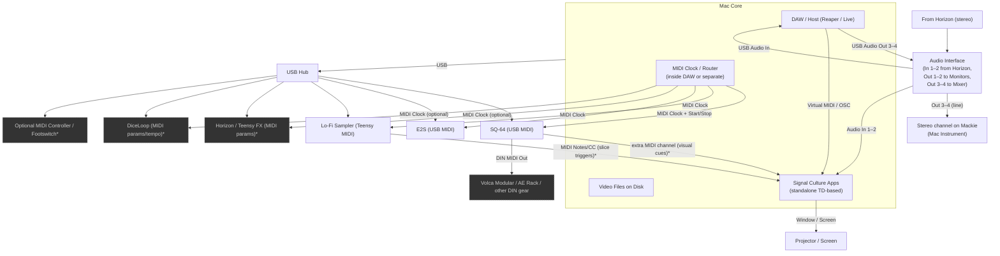

# 03 – MIDI, Clock, and Video / Mac Integration

## Notes

- [ ] Confirm which app (DAW vs. standalone clock tool) is your **tempo master**.
- [ ] Decide which devices actually need clock vs. just note/CC.
- [ ] Define a “visual MIDI” channel for SCApps (SQ64 track, Lo-Fi Sampler events, etc.).
- [ ] List your virtual MIDI bus names (IAC / loopMIDI / etc.).
