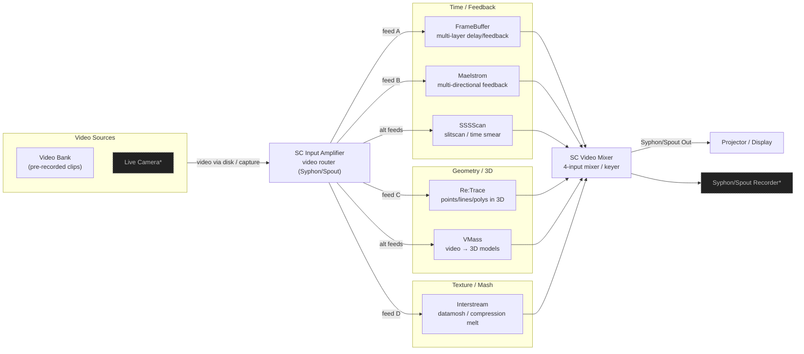

# 04 – SCApps Overview (Owned Apps Only)

This maps the Signal Culture apps you own into a single “video pedalboard” view.

Owned apps:

- InputAmp
- VidMix
- FrameBuffer
- Maelstrom
- SSSScan
- Re:Trace
- VMass
- Interstream

## App Cheat Notes

(Short reminders; expand these with real parameter names and CCs later.)

### InputAmp
- **Analogy:** video patchbay / mult.
- **Use for:** routing multiple clips/cameras into several processors at once.
- **Good MIDI:** source select, simple crossfades (if exposed).

### VidMix
- **Analogy:** Mackie mixer for video.
- **Use for:** blending 2–4 processed feeds, keying, wipes.
- **Good MIDI:** per-channel faders, A/B crossfader, kill-to-black button.

### FrameBuffer
- **Analogy:** multi-tap delay/looper.
- **Use for:** echoes, trails, rhythmic repeats, recursive feedback.
- **Good MIDI:** buffer length / delay time, feedback amount, layer mix.

### Maelstrom
- **Analogy:** complex feedback matrix.
- **Use for:** swirling storms, tunnels, spatial feedback.
- **Good MIDI:** X/Y translation, feedback density, reset/panic.

### SSSScan
- **Analogy:** slitscan / granular timesmear.
- **Use for:** dragging slices of image through time.
- **Good MIDI:** slit position, scan speed/direction, slit thickness.

### Re:Trace
- **Analogy:** additive resynthesis in 3D (points/lines from image).
- **Use for:** wireframes, point clouds, rotating image geometry.
- **Good MIDI:** rotation, zoom, density/line thickness.

### VMass
- **Analogy:** video as texture on 3D synth voice.
- **Use for:** mapping video onto primitives/models, orbiting, deforming.
- **Good MIDI:** orbit angle, scale, “bumpiness” / deformation amount.

### Interstream
- **Analogy:** datamosh / bitcrusher bus.
- **Use for:** melting cuts, blooming glitches, compression smears.
- **Good MIDI:** mosh intensity, decay/reset time, hard “mosh now” button.

## Notes

- [ ] For each app, write down the exact parameter names and MIDI CC numbers you want to use live.
- [ ] Decide which 2–3 apps will be “always armed” in a typical show.
- [ ] Note CPU load expectations when running multiple apps.
