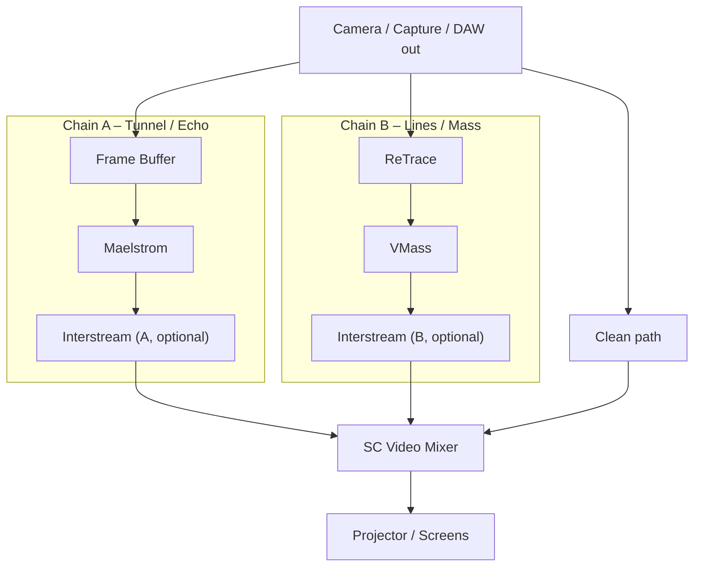
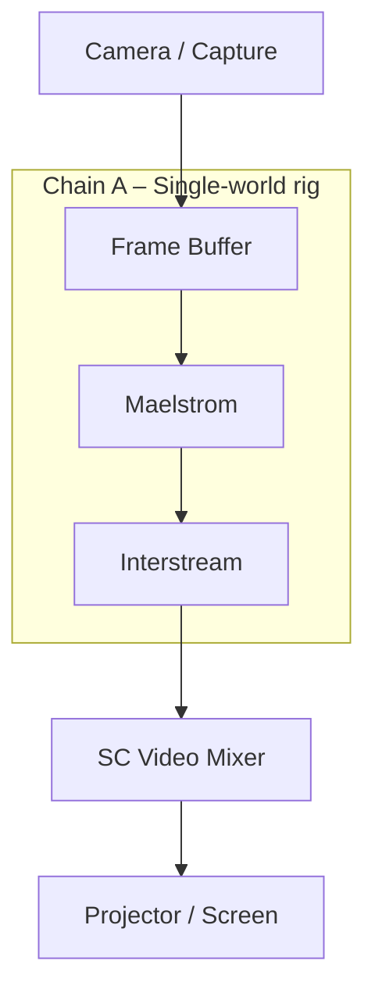

# 05 – SCapps rigs

This document captures **concrete SCapps configurations** (“rigs”) for different contexts:

- How apps are chained.
- Which inputs/outputs they use.
- Which **scenes** they rely on.

It’s where the abstract ideas from `04_scapps-overview.md` and `09_scene-system.md` get nailed into specific setups.

---

## Common building blocks

Across rigs, we reuse a small set of “chains”:

- **Chain A – Tunnel / echo world**

  ```text
  Camera / source
      → Frame Buffer
      → Maelstrom
      → (optional Interstream)
      → SC Video Mixer Input 1
  ```

- **Chain B – Line / mass world**

  ```text
  Camera / source
      → ReTrace
      → VMass
      → (optional Interstream)
      → SC Video Mixer Input 2
  ```

- **Chain C – Clean**

  ```text
  Camera / source
      → (minimal correction / color)
      → SC Video Mixer Input 3
  ```

- **Chain D – Black / utility**

  ```text
  Black / text / safety frame
      → SC Video Mixer Input 4
  ```

Scenes (see `09_scene-system.md` and `scenes/*.yaml`) mostly control:

- SC Video Mixer **input levels** (A/B/C/D),
- a handful of **key parameters** in each chain.

---

## Rig 1 – EP: *i hope the sky will still take us*

Main rig for the EP and the “MN42 + SCapps” performance setup.

### Intent

- Audio is heavy, slow-burning, often saturated.
- Visuals move between:
  - soft, distant echoes (`SOFT_ASH`),
  - seething, angel-swarm glitch (`ANGEL_SWARM`),
  - almost documentary (`CLEAN_CAMERA`),
  - full blackout / fail-safe (`BLACKOUT`).

### Chain layout



- **Input 1** – Chain A output (FrameBuffer → Maelstrom → Interstream A).  
- **Input 2** – Chain B output (ReTrace → VMass → Interstream B).  
- **Input 3** – Clean path.  
- **Input 4** – Black / text layer (if used).

### Scenes

Defined in:

- `scenes/ep-i-hope-scenes.yaml`
- Documented narratively in `09_scene-system.md`.

Core scenes:

1. **`SOFT_ASH`**
   - Mixer:
     - Input1 ≈ 0.8, Input2 ≈ 0.2, Input3 = 0, Input4 = 0.
   - Frame Buffer:
     - Low feedback, soft key.
   - Maelstrom:
     - Medium-shallow depth, slow rotation.
   - ReTrace + VMass:
     - Sparse lines, moderate texture.
   - Interstream:
     - Minimal mosh (mostly off).
   - Analysis:
     - Weight ~0.5; visuals breathe with mix but don’t slam.

2. **`ANGEL_SWARM`**
   - Mixer:
     - Input1 ≈ 0.1, Input2 ≈ 0.9 (Chain B dominant).
   - Frame Buffer:
     - High feedback, harder key.
   - Maelstrom:
     - Deeper tunnel, more spin.
   - ReTrace + VMass:
     - Dense lines, heavy grain/mass.
   - Interstream:
     - High mosh amount; tearing and bloom.
   - Analysis:
     - Weight ~0.8; frZone has strong influence.

3. **`CLEAN_CAMERA`**
   - Mixer:
     - Input1 = 0, Input2 = 0, Input3 = 1, Input4 = 0.
   - All other parameters:
     - Neutral or ignored (depending on bridge implementation).
   - Analysis:
     - Weight low or 0; focus on “what is actually happening”.

4. **`BLACKOUT`**
   - Mixer:
     - Input4 = 1 (black / safety), others = 0.
   - `hard_override: true` in scene table:
     - analysis + macros ignored.
   - Use for:
     - resets, tuning, emergency “off”.

Scene triggers (example mapping):

- Edirol on **Ch 10**:
  - Note 60 → `SOFT_ASH`
  - Note 61 → `ANGEL_SWARM`
  - Note 62 → `CLEAN_CAMERA`
  - Note 63 → `BLACKOUT`

Exact note choices/mappings live in:

- `scenes/ep-i-hope-scenes.yaml`
- `08_midi-mapping-…` for the specific show.

### Control roles

- **Edirol (Ch 10)**:
  - Faders (example):
    - 1: `macro.vmix_morph` (A/B balance within current scene).
    - 2: `macro.fb_feedback`.
    - 3: `macro.mael_depth`.
    - 4: `macro.mosh`.
    - 5: `macro.retrace_density`.
    - 6: `macro.texture_detail` (VMass).
    - 7: global contrast.
    - 8: spare / per-show special.
  - Knobs:
    - fine control for spin, jitter, blend between analysis vs manual.
  - Buttons:
    - mapped to scenes as above.

- **frZone (Ch 15)**:
  - `CC 20` low band → bias Frame Buffer feedback.
  - `CC 22` mid band → bias Maelstrom depth.
  - `CC 23` upper mids → bias ReTrace density.
  - `CC 24` highs → bias Interstream mosh / VMass detail.

All blended according to the rules in `09_scene-system.md`.

---

## Rig 2 – Basement noise night

Simpler setup for tighter spaces or more chaotic shows.

### Intent

- Faster setup, less to go wrong.
- Visuals still locked to sound, but with fewer moving parts.
- Emphasis on bold gestures over fine nuance.

### Chain layout



In this rig:

- Only **one processed chain** (A) plus:
  - **Input 1** – processed chain.
  - **Input 2** – clean feed.
  - **Input 3** – optional black / text.
  - **Input 4** – unused or held in reserve.

Scenes (if used) still exist but:

- Shift depth and feedback.
- Tame or unleash Interstream.

You can reuse the same scene names but with:

- smaller parameter spreads,
- simpler mixer levels (e.g., just 0 or 1 on clean/processed).

---

## Rig 3 – Gallery / installation (template)

Placeholder for a slower, more ambient, potentially autonomous rig.

### Intent

- Longer dwell times.
- Less “showmanship”, more environment.
- Possibly running without a human at Edirol the whole time.

Derive from the EP rig by:

- Increasing scene `ramp_ms` for all non-emergency scenes.
- Allowing **frZone** to dominate:
  - set `analysis.weight` high for all scenes.
- Mapping Edirol to very small macro ranges or leaving it unused.

Document the specific gallery rig when one is committed.

---

## Adding a new rig

When you build a new performance configuration:

1. **Name it**: `Rig X – something`.
2. Add a **short intent** section:
   - what it’s for,
   - how it should feel.
3. Draw a simple **chain diagram** (mermaid or ASCII).
4. Declare:
   - which chains (A/B/C/D) are used,
   - how SC Video Mixer inputs are assigned.
5. Reference:
   - which **scene table file** it uses (e.g. `scenes/rig4-something.yaml`).
   - any special **MIDI mapping** docs.

Keep this file focused on **SCapps and chain shapes**; audio details live in `02_audio-mixer-fx.md`, and MIDI details in `03_midi-clock-video.md` + `08_midi-mapping-…`.

---

## Relationships to other docs

- `01_system-overview.md`  
  - The big three lanes (audio, control, video).

- `02_audio-mixer-fx.md`  
  - How the mixer feeds frZone and LineLight and where the camera feed originates.

- `03_midi-clock-video.md`  
  - Channel roles and the Edirol / frZone lanes.

- `04_scapps-overview.md`  
  - Per-app roles and parameters.

- `09_scene-system.md` + `scenes/*.yaml`  
  - How scenes are defined and animated over time.

This file is where those pieces **meet** in the form of actual rigs.
