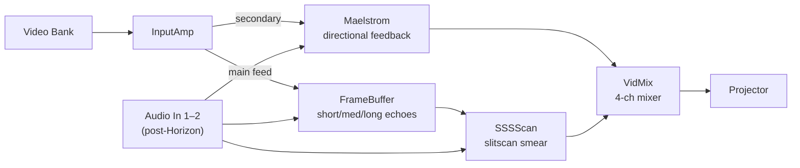
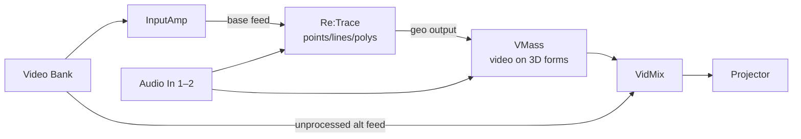
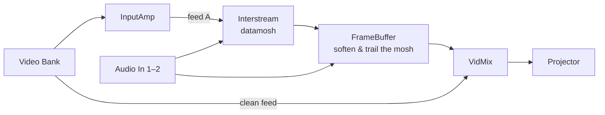

# 05 – SCApps Rig Templates

Three standard SCApp “rigs” you can recall and adapt for shows.

---

## Rig 1 – Time / Feedback Bus

### Notes

- [ ] Choose 2–3 clips to rotate through in VidBank for this rig.
- [ ] Decide which audio features (kick, snare, overall RMS) modulate which parameters.
- [ ] Map 3–4 MIDI controls:
  - [ ] Global delay/feedback feel
  - [ ] Amount of Maelstrom vs SSSScan in VidMix
  - [ ] One big “wipe/reset” gesture

---

## Rig 2 – Geometry / 3D Bus

### Notes

- [ ] Pick one “figurative” clip and one “abstract” clip for contrast.
- [ ] Define camera/orbit presets in VMass (e.g., calm / orbit / extreme).
- [ ] MIDI ideas:
  - [ ] Fader: crossfade clean vs VMass in VidMix
  - [ ] Knob: rotation speed
  - [ ] Knob: deformation amount

---

## Rig 3 – Texture / Mash Bus

### Notes

- [ ] Choose clips that look good both clean and broken.
- [ ] Decide how aggressively Interstream should respond to audio (subtle vs brutal).
- [ ] MIDI ideas:
  - [ ] Fader: clean vs mosh crossfade in VidMix
  - [ ] Knob: glitch intensity
  - [ ] Button: “mosh burst” on demand
