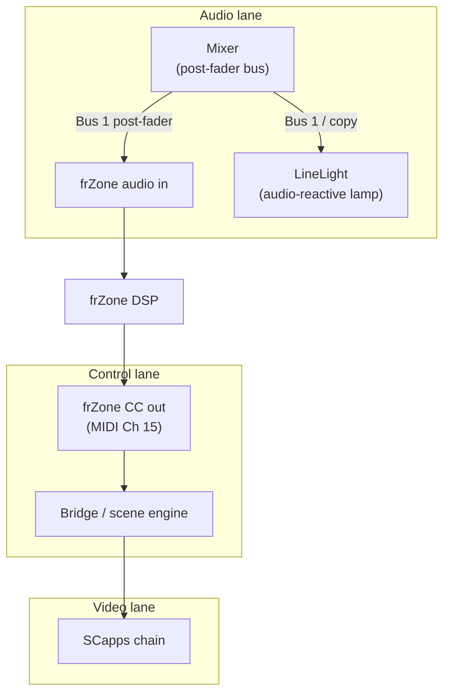

# 06 – frZone & LineLight

This document describes the **analysis lane** of the rig:

- how **frZone** listens to the mix and emits control data,  
- how **LineLight** acts as a physical indicator of that same energy,  
- how both relate to scenes, Edirol macros, and SCapps.

Think of this as the **breathing system** that lets visuals follow sound.

---

## Role in the rig

In the three-lane model from `01_system-overview.md`:

- frZone lives in the **control lane**, but listens to the **audio lane**.
- LineLight lives in the **audio lane**, but is conceptually part indicator, part stage presence.
- Their output primarily affects the **video lane** (SCapps) via the bridge.

High-level flow:



---

## Audio routing to frZone

frZone needs a **post-fader**, “real world” view of the mix:

- If you mute a channel, it should stop influencing the visuals.
- If you ride a fader, the analysis should track that change.

### Recommended routing

- Use **Aux 1** (or equivalent) as a **post-fader send** on channels that matter for visuals:
  - DrumKid: send medium–high.
  - AE Rack: send medium.
  - Lo-Fi Sampler: send medium–low (if very distorted).
  - DAW / laptop: send as needed.
  - Guest channels: case by case.

- Aux 1 output → **frZone input**  
  - Either directly, or via an interface input normalled to frZone.

If your mixer doesn’t have a dedicated Aux:

- Use a **Control Room / Rec Out** or a subgroup that follows the main faders; note the deviation in the show-specific doc (`07_show-…`).

Key principle:

> frZone should hear **approximately what the audience hears**, not a separate, pre-fader submix.

---

## MIDI output from frZone (Ch 15)

frZone turns that bus into CC values on the **analysis channel** (Ch 15).

Canonical mapping for this rig:

| CC  | Band      | Semantic role                             | Typical use in bridge          |
|-----|-----------|--------------------------------------------|--------------------------------|
| 20  | Low       | Kick / bass energy                        | Bias Frame Buffer feedback     |
| 22  | Mid       | Body of mix (snare, synths, voice center) | Bias Maelstrom depth           |
| 23  | Upper mid | Presence, edge, grit                      | Bias ReTrace density           |
| 24  | High      | Cymbals, hiss, noise                      | Bias Interstream / VMass detail|

These CCs are:

- **Sent on MIDI Channel 15**.
- Picked up by the **bridge** and fed into the **scene engine** described in `09_scene-system.md`.

Each scene has an `analysis.weight` (0–1) that describes **how much power** these CCs have to move parameters.

---

## Combining frZone with scenes and macros

For any given parameter in SCapps, the bridge typically computes:

```text
effective_value = clamp(
    scene_base
  + analysis_weight * analysis_bias
  + manual_offset,
  0.0, 1.0
)
```

Where:

- `scene_base` – from the active scene (`scenes/*.yaml`).
- `analysis_weight` – from that scene’s `analysis.weight` value.
- `analysis_bias` – derived from frZone CCs (normalized, maybe low-passed).
- `manual_offset` – from Edirol faders/knobs on Ch 10.

Examples:

- Frame Buffer feedback:
  - `scene_base.fb_feedback` from scene.
  - `analysis_bias` from CC 20 (low band).
  - `manual_offset` from `macro.fb_feedback` fader.

- Maelstrom depth:
  - `scene_base.mael_depth`.
  - `analysis_bias` from CC 22 (mid band).
  - `manual_offset` from `macro.mael_depth`.

`BLACKOUT` or similar hard override scenes can set `analysis.weight = 0` and/or ignore frZone entirely for safety.

---

## LineLight: physical indicator

LineLight is a **physical, audio-reactive light** in the room.

- It has **no MIDI role** in this rig.
- It is driven by **audio**, usually the same bus feeding frZone or a copy of it.

Recommended wiring:

- Same **Aux 1 bus** as frZone (via split or parallel feed), or
- A **Control Room** or **monitor out** that closely matches the post-Horizon mix.

Functional roles:

- **Performer feedback**:
  - If LineLight is dead while audio is loud, something’s wrong with the analysis bus.
- **Audience cue**:
  - Even when the projection surface is subtle or obscured, LineLight hints at dynamics.
- **Debug aid**:
  - Use it as a quick visual check that the analysis feed isn’t muted or mispatched.

You don’t need to document LineLight’s exact wiring per show unless it deviates significantly; note any changes in `07_show-…` and update this file only when the **standard** pattern changes.

---

## Calibration and tuning

### Audio level into frZone

You want frZone to:

- Respond clearly to musical dynamics,
- Without constantly clipping or sitting at a flat maximum.

Suggested process:

1. Set typical show levels on the mixer:
   - Drums at performance volume,
   - Synths and other sources in place.
2. Raise Aux 1 sends to frZone gradually:
   - Watch frZone’s meters.
3. Adjust:
   - Aux send levels per channel,
   - Overall Aux master level,
   - and frZone input gain (if available)
   until:
   - Quiet sections produce modest CC movement.
   - Loud sections push CCs near the top, but not hard clipped.

Capture any “sweet spot” observations in `notes/` (e.g. “Aux 1 at ~2 o’clock felt best for frZone”).

### MIDI scaling in the bridge

In the bridge, you will often:

- Low-pass filter frZone CCs (to avoid jitter).
- Remap CC ranges to useful 0–1 zones for each parameter.
- Possibly apply **soft knees** so the first bit of movement is gentle, and only very loud moments push into extremes.

These details belong in the bridge project, but you can record overall behaviors here (e.g. “low band CC rarely exceeds 0.7 in usual practice”).

---

## Troubleshooting

If the visuals feel dead or disconnected, check in this order:

1. **LineLight**
   - Is it reacting to the music?
   - If not, check:
     - Mixer Aux send to LineLight.
     - The cable or power to LineLight.

2. **frZone input**
   - Is frZone showing input audio?
   - If not:
     - Check Aux 1 send to frZone.
     - Check frZone’s input device in its settings.

3. **MIDI from frZone**
   - Is frZone sending MIDI on **Ch 15**?
   - On the bridge machine:
     - Use a MIDI monitor to see CC 20/22/23/24 arrive.
     - If nothing arrives, re-check device/port settings.

4. **Bridge mapping**
   - Is the bridge actually listening to Ch 15 on the right port?
   - Are the CC numbers aligned with what this file says?
   - Temporarily map a frZone CC directly to an obvious visual parameter to test.

5. **Scene / analysis weight**
   - In the active scene definition:
     - Is `analysis.weight` set too low or zero?
   - Try a test scene where `analysis.weight = 1.0` and watch for movement.

Make brief notes for any venue-specific quirks in:

- `07_show-…` (for that night),
- and `notes/` if you find a general lesson.

---

## Safety and aesthetics

frZone and LineLight together can easily push the rig into “too much” if left unchecked.

Some guardrails:

- Keep **frZone’s band mapping stable** across shows:
  - Low → Frame Buffer,
  - Mid → Maelstrom,
  - Upper-mid → ReTrace,
  - High → Interstream/VMass.
- Use **moderate analysis.weight** in most scenes (0.4–0.7) so your hands still matter.
- Reserve **very high analysis.weight** for specific, deliberate scenes.
- LineLight brightness or sensitivity should match:
  - The typical dynamic range of your set,
  - The size and brightness of the performance space.

If you change these patterns in a lasting way, update this file and any associated scene tables.

---

## Relationship to other docs

- `01_system-overview.md`  
  - Places frZone and LineLight in the three-lane model.

- `02_audio-mixer-fx.md`  
  - Details mixer channel layout and which buses feed frZone / LineLight.

- `03_midi-clock-video.md`  
  - Declares Channel 15 as the analysis lane and lists CC → band mappings.

- `04_scapps-overview.md`  
  - Shows how specific SCapps parameters are influenced by analysis.

- `05_scapps-rigs.md`  
  - Specifies how analysis behaves in each rig (EP vs basement vs gallery).

- `09_scene-system.md` + `scenes/*.yaml`  
  - Defines how analysis.weight and scene_base values interact.

This file should remain the **single source of truth** for what “analysis” means in this rig and how the glowing line in the room relates to the light on the wall.
