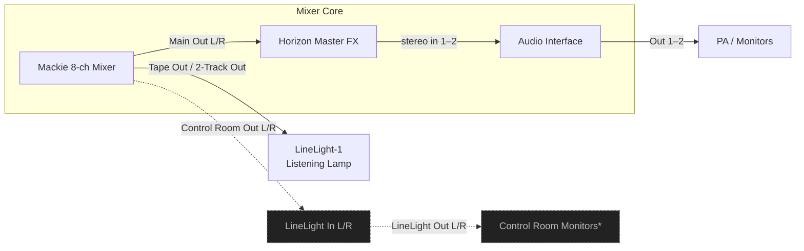
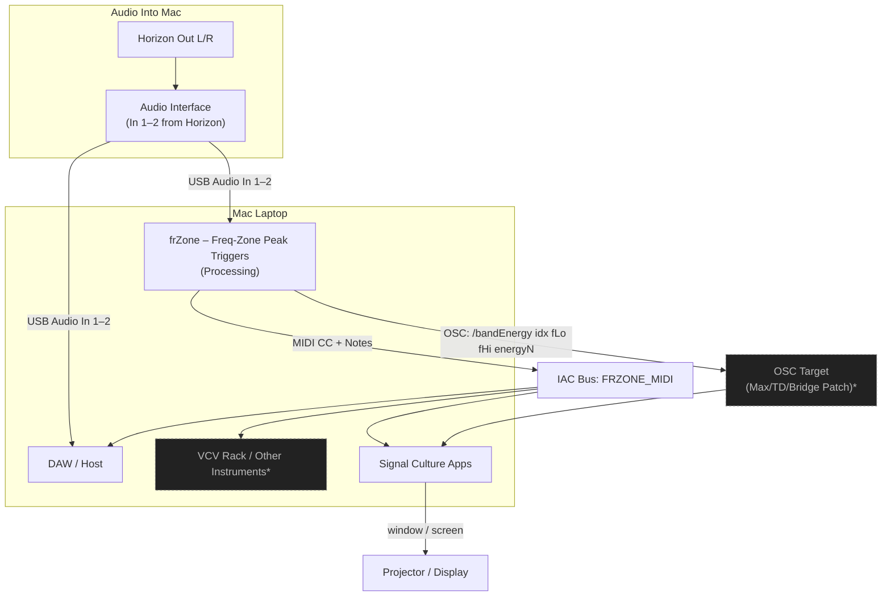

# 06 – frZone + LineLight Integration

These two machines are “glue and glitter” for the rig:

- **LineLight‑1** — a listening lamp for artists; taps a line-level feed and maps a frequency band to LED brightness.
- **frZone** — Freq‑Zone Peak Triggers; listens to audio, slices it into bands, and outputs MIDI CC/notes + OSC based on band energy.

---

## 6.1 LineLight in the Audio / Mixer Layer

The simplest, safest integration is to let LineLight “listen” to a parallel tap of the main mix (Tape/2‑Track Out), so it can never break FOH audio.

### Notes – LineLight

- [ ] Decide which **output** from the Mackie to dedicate as LineLight’s “ear”:
  - [ ] Tape Out / 2‑Track Out (recommended simple option)
  - [ ] Control Room Out (if you want it inline with your own monitors)
  - [ ] A dedicated Aux / Submix (for drums‑only, low‑end‑only, etc.)
- [ ] For each show, note which **band** (low/mid/high) you want LineLight listening to.
- [ ] Think about **placement**:
  - [ ] On table facing audience
  - [ ] Behind you, modulating your silhouette
  - [ ] Near projector / screen as a “halo”

---

## 6.2 frZone in the Mac / SCApps Layer

frZone lives entirely on the Mac. It listens to the same post‑Horizon stereo you feed the interface, and emits MIDI + OSC to drive visuals and other software.

### Notes – frZone

- [ ] In frZone, select the **audio input** that corresponds to the interface’s post‑Horizon stereo (In 1–2).
- [ ] Set up an **IAC Bus** (e.g., `FRZONE_MIDI`) and confirm:
  - [ ] DAW can see it and route CC/notes to instruments/FX.
  - [ ] Your SCApps bridge patch (Max/TD/other) can also see it.
- [ ] Define a **band‑to‑meaning map** per show, e.g.:
  - Band 0 (low) → FrameBuffer feedback
  - Band 2 (mid) → Re:Trace/VMass density or deformation
  - Band 4 (high) → Interstream mosh intensity or VidMix stutter
- [ ] Save different frZone profiles (`data/mapping.json`) for:
  - [ ] “Club” set (rhythm‑driven mapping)
  - [ ] “Noise / drone” set (texture‑driven mapping)
- [ ] Decide what frZone should *not* control, so you still have manual “safe” knobs.

---

## 6.3 Mental Layering

- **LineLight** sits on the **physical / stage** layer:
  - A visible, analog indicator of your mix’s energy in a chosen band.
- **frZone** sits on the **logic / control** layer:
  - A programmable bridge from sound → control signals → video and synth behavior.

Together they:

- Make the **audible structure** of your set more visible (LineLight), and
- Make the **spectral structure** of your set more actionable in software (frZone).
