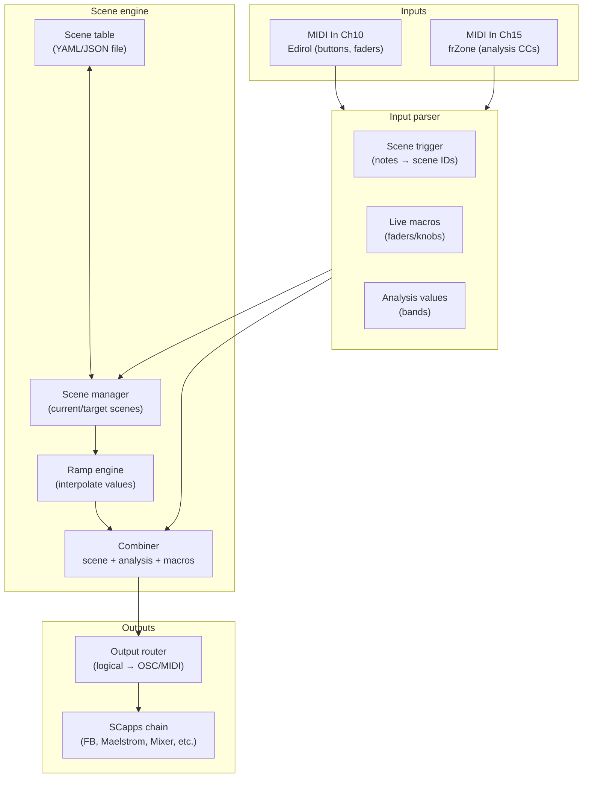

# 09 – Scene system

This document describes how **scenes** work in the live rig:

- what a “scene” is,
- how scenes are triggered from the Edirol,
- how a bridge app turns those triggers into parameter changes,
- and how frZone and your hands bias things inside each scene.

It’s deliberately **host-agnostic**: whether the bridge is Max, TouchDesigner, REAPER+JS, or something else, the concepts and file formats stay the same.

---

## What is a scene?

In this rig, a **scene** is:

> a named snapshot of how the video world is wired and behaving

A scene can include:

- **Structural choices**  
  - Which SCapps chain is dominant in the SC Video Mixer.  
  - How much clean camera vs processed image is visible.  
  - Whether the “blackout / utility” channel is active.

- **Parametric choices**  
  - Frame Buffer feedback and key softness.  
  - Maelstrom tunnel depth / rotation.  
  - Interstream mosh amount.  
  - Any other SCapp parameters you care about.

- **Analysis weighting**  
  - How strongly frZone’s bands (Ch 15 CCs) can bias those parameters.

Examples for the *i hope the sky will still take us* rig:

- `SOFT_ASH` – gentle tunnels, low feedback, mostly chain A.  
- `ANGEL_SWARM` – aggressive feedback, mosh blooms, chain B dominant.  
- `CLEAN_CAMERA` – almost documentary; minimal processing.  
- `BLACKOUT` – safety switch / dramatic silence.

---

## Scene triggers (Edirol on Ch 10)

Scenes are triggered from the Edirol controller on the **visual control channel** (Ch 10).

By convention:

- **Channel**: 10  
- **Button notes** (example mapping):

| Button | MIDI note (Ch 10) | Scene ID      |
|--------|-------------------|---------------|
| 1      | 60                | SOFT_ASH      |
| 2      | 61                | ANGEL_SWARM   |
| 3      | 62                | CLEAN_CAMERA  |
| 4      | 63                | BLACKOUT      |

The exact note numbers can change per rig or per show, but:

- Ch 10 is reserved for Edirol-driven **visual macros and scene triggers**.
- The mapping between notes and scene IDs is recorded in a **scene table file** (see below).

Other Edirol controls (faders/knobs) still act as **live macros** on top of whatever scene is active.

---

## Scene table (machine-readable definition)

Scene definitions live in a separate file so they can be:

- human-readable in the repo,
- and machine-readable in the bridge.

Example path for the EP rig:

- `scenes/ep-i-hope-scenes.yaml`

### Example table (YAML)

```yaml
rig: "i-hope-the-sky-will-still-take-us"

channel_scene_triggers:
  midi_channel: 10
  note_map:
    60: "SOFT_ASH"
    61: "ANGEL_SWARM"
    62: "CLEAN_CAMERA"
    63: "BLACKOUT"

scenes:
  SOFT_ASH:
    label: "Soft ash"
    description: "Gentle tunnels, low feedback, mostly chain A."
    ramp_ms: 800
    video_mixer:
      input_levels:
        1: 0.8
        2: 0.2
        3: 0.0
        4: 0.0
    frame_buffer:
      feedback: 0.3
      key_softness: 0.6
    maelstrom:
      depth: 0.4
      rotation: 0.1
    interstream:
      mosh_amount: 0.0
    analysis:
      weight: 0.5

  ANGEL_SWARM:
    label: "Angel swarm"
    description: "High feedback, aggressive mosh, mostly chain B."
    ramp_ms: 700
    video_mixer:
      input_levels:
        1: 0.1
        2: 0.9
        3: 0.0
        4: 0.0
    frame_buffer:
      feedback: 0.8
      key_softness: 0.2
    maelstrom:
      depth: 0.7
      rotation: 0.3
    interstream:
      mosh_amount: 0.9
    analysis:
      weight: 0.8

  CLEAN_CAMERA:
    label: "Clean camera"
    description: "Minimal processing, almost documentary."
    ramp_ms: 500
    video_mixer:
      input_levels:
        1: 0.0
        2: 0.0
        3: 1.0
        4: 0.0

  BLACKOUT:
    label: "Blackout"
    description: "Safety switch and dramatic silence."
    ramp_ms: 0
    video_mixer:
      input_levels:
        1: 0.0
        2: 0.0
        3: 0.0
        4: 1.0
    hard_override: true
```

You can use YAML, JSON, or any structured format you like, as long as the bridge can parse it.

---

## Scene engine (bridge architecture)

The **scene engine** lives in the bridge layer (Max, TouchDesigner, REAPER+JS, etc.). It sits between:

- MIDI in (Edirol on Ch 10, frZone on Ch 15),
- and SCapps (Frame Buffer, Maelstrom, Re:Trace, SC Video Mixer, etc.).



Responsibilities:

- **Input parser**
  - Filters Edirol messages on Ch 10:
    - Notes → `scene_trigger(scene_id)`
    - CCs → named macros, e.g. `macro("fb_feedback_offset", value)`
  - Filters frZone messages on Ch 15:
    - CC20/22/23/24 → `analysis("low_band", value)`, etc.

- **Scene manager**
  - Loads scene definitions from the **scene table**.
  - On `scene_trigger(id)`:
    - Looks up `scenes[id]`.
    - Extracts target values for each parameter.
    - Hands targets + `ramp_ms` to the Ramp Engine.

- **Ramp engine**
  - Interpolates current parameter values → target values over time.
  - Provides smooth movement instead of abrupt jumps.

- **Combiner**
  - For each parameter, computes:

    ```text
    effective_value = clamp(
        scene_base
      + analysis_weight * analysis_bias
      + manual_offset,
      0.0, 1.0
    )
    ```

- **Output router**
  - Maps logical parameter names to actual OSC/MIDI endpoints:
    - `vmix_input1` → `/scvm/input1/level` or MIDI CC on SC Video Mixer.
    - `fb.feedback` → `/framebuffer/feedback`.
  - Sends values at a reasonable rate (e.g. per frame / per control tick).

---

## Analysis and macros inside a scene

A scene is not a cage; it’s a **center of gravity**.

For any given parameter:

- `scene_base` – comes from the scene table (e.g. `feedback = 0.8` in `ANGEL_SWARM`).
- `analysis_bias` – derived from frZone CCs (Ch 15), scaled by the current scene’s `analysis.weight`.
- `manual_offset` – Edirol fader/knob position (Ch 10), mapped to a small range (e.g. ±0.2 around the base).

Conceptually:

```text
effective_param = clamp(
  scene_base
  + analysis_weight * analysis_bias
  + manual_offset,
  0.0, 1.0
)
```

Implications:

- Changing scenes feels like the **world shifts** around you.  
- frZone ensures the world still **breathes with the sound**.  
- Edirol lets you **push and pull** inside that world without redefining the scene.

`BLACKOUT` (and any other `hard_override` scenes) can bypass analysis and macros entirely for safety.

---

## Host notes (Max / TouchDesigner / REAPER)

The implementation details live in your bridge project, not here, but some expectations are consistent:

- **Max**:
  - `notein` / `ctlin` ↔ Ch 10, 15.
  - `dict` or JS for the scene table.
  - `line` / `slide` or JS for ramping.
  - `udpsend` for OSC to SCapps.

- **TouchDesigner**:
  - MIDI In CHOPs for Ch 10 / 15.
  - Table DATs / JSON DAT for scene definitions.
  - Math + Filter CHOPs for blending / ramping.
  - OSC Out DAT or MIDI Out CHOP for SCapps.

- **REAPER**:
  - MIDI from Edirol / frZone into dedicated tracks.
  - JSFX or ReaScript handling:
    - scene lookup,
    - ramping,
    - OSC output.

Whichever host you use, the **scene file** and this doc should remain accurate so the rig’s logic stays legible.

---

## Where scenes are referenced elsewhere in the repo

- `03_midi-clock-video.md`  
  - Declares that **Ch 10** is the visual control channel and reserves certain notes/CCs for scene triggers.

- `04_scapps-overview.md`  
  - Describes which SCapps are in use and what their major parameters are.

- `05_scapps-rigs.md`  
  - Shows **concrete rigs** and which scenes they rely on.

- `08_midi-mapping-YYYY-MM-DD-… .md`  
  - Locks in the **exact** note/CC assignments for a specific show.

- `scenes/*.yaml`  
  - Machine-readable scene tables:
    - Edirol note → scene ID.
    - Per-scene target values.
    - Analysis weights and ramp times.

This file (`09_scene-system.md`) is the glue that describes how those pieces hang together.
